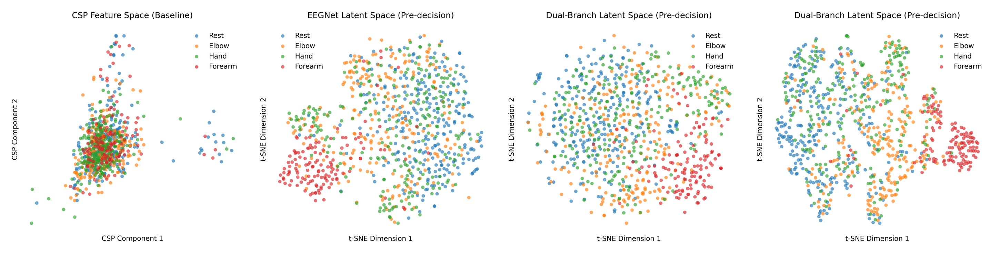
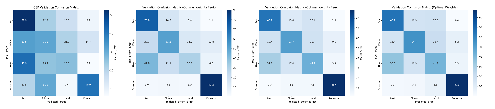

# EEG-Based Same-Limb Movement Classification

**Overcoming CSP Limitations with Deep Learning**

This repository decodes upper-limb movement states from non-invasive scalp EEG. It frames a four-class **intra-limb** decoding problem (elbow, hand, forearm, rest) and contrasts a classical Common Spatial Pattern + Linear Discriminant Analysis (CSP+LDA) baseline against three convolutional architectures of increasing complexity: EEGNet (temporal only), EEGPsdNet (temporal + spectral fusion) and EEGConnNet (temporal + connectivity attention fusion).

The work was developed as a Human-Machine Interfaces (HMI) final project at Universitat Politecnica de Catalunya (ETSEIB), building on the open Graz movement-execution corpus by Ofner et al. (2017).

---

## Project overview

The central question is what kind of representation is required to tell apart movements that all originate from the *same* limb. This matters because the CSP+LDA pipeline is the canonical, highly effective solution for binary *inter-limb* decoding (for example left hand vs. right hand), where the two classes activate clearly separated, lateralized cortical regions. When the classes instead correspond to different actions of one arm (elbow, forearm, hand), their cortical activation patterns overlap heavily within the same hemisphere, and the linear variance-based filters that CSP relies on lose most of their discriminative power.

Two analytical frameworks are applied to identical cue-locked data so the comparison is fair:

- **Block I (classical baseline).** CSP spatial filters optimized to maximize the log-band-power variance ratio between classes, reduced to six components, classified with LDA. This is the reference point and the method the project sets out to beat.
- **Block II (convolutional decoders).** A standard EEGNet operating on the filtered voltage epochs, plus two custom dual-branch models that fuse the temporal stream with auxiliary spectral or connectivity features.

The empirical result is a clear progression: the linear baseline sits near chance for this four-class task, a temporal CNN recovers a large jump in accuracy, and adding multimodal priors (spectral or connectivity) buys a further, smaller gain. The conclusion is that successful same-limb decoding depends on non-linear spatio-temporal dynamics that simple spatial variance filters cannot capture, and that structural network information complements raw voltage dynamics.

---

## Dataset

Experiments use the open **Graz upper-limb movement-execution EEG corpus** (Ofner, Schwarz, Pereira, Muller-Putz, 2017; BNCI Horizon 2020, accession `001-2017`).

Subjects 1 to 15 are available here:
**https://drive.google.com/drive/u/1/folders/1DeYdzbY0aLqKodcDOInu6srHgRFT03Mr**

### Acquisition (original recording)

- **15 healthy subjects** aged 22-40 (mean 27.0 +/- 5.0); nine female; all right-handed except s1.
- The right arm was supported by an anti-gravity exoskeleton to avoid muscle fatigue. All movements began from a neutral position (hand half open, lower arm at 120 degrees, neutral rotation).
- **Six movement types plus rest:** elbow flexion/extension, forearm supination/pronation, hand open/close, and a rest condition.
- Trial-based paradigm: at second 0 a beep sounded and a fixation cross appeared (warning stimulus); at second 2 a visual cue indicated the required movement (imperative stimulus); the subject then executed a sustained movement and returned to the start, followed by a random 2-3 s break.
- **10 runs per subject**, 42 trials per run, yielding **60 trials per class** per subject.
- **EEG:** 61 active electrodes over frontal, central, parietal and temporal areas, referenced to the right mastoid. Three EOG channels share the same reference.
- Acquired at **512 Hz** with an 8th-order Chebyshev band-pass (0.01-200 Hz) and a 50 Hz notch.
- Position sensors (not used here): exoskeleton (13 channels, arm joint angles) and 5DT data glove (19 channels, finger positions).

### File format

One MAT file per run named `ME_SXX_rYY.mat`, containing a structure `EEG` with three fields:

- `data` - matrix of size `[channels x samples]`.
- `events` - matrix with three columns: event code (movement/rest class), latency (sample of the imperative cue), and movement onset sample (0 if none).
- `chanlocs` - channel labels and electrode coordinates.

Event codes map to classes as follows:

| Code | 1536 | 1537 | 1538 | 1539 | 1540 | 1541 | 1542 |
|------|------|------|------|------|------|------|------|
| Class | elbow flexion | elbow extension | supination | pronation | hand close | hand open | rest |

### Expected layout

After download, place the runs under `data/raw/` using the naming convention the loader expects:

```
data/raw/S1/ME_S1_r1.mat, ME_S1_r2.mat, ...
data/raw/S2/ME_S2_r1.mat, ...
```

Subject folders are `S{n}` and run files follow `ME_S{subject}_r{run}.mat`. The build step automatically discovers any folder that contains at least one `ME_*.mat` file.

---

## Pipeline

The pipeline transforms the raw multi-run recordings into three aligned feature tensors per trial, then trains and evaluates each model on the same stratified split.

### 1. Channel selection

From the 61 recorded electrodes, analysis is restricted to **21 peri-central channels** over the fronto-central, central and centro-parietal regions (FC5-FC6, FCz, C5-C6, Cz, CP5-CP6, CPz), concentrating the montage on the sensorimotor cortex where motor-related activity is strongest.

### 2. Filtering and resampling

Continuous EEG is downsampled from 512 Hz to **128 Hz**, a mains-notch filter is applied, and a zero-phase FIR band-pass (**0.5-40 Hz**) preserves the low-frequency time-domain dynamics that carry the movement information, without introducing phase distortion.

### 3. Epoching and artifact rejection

Cue-locked epochs are extracted from **-0.5 to 2.0 s** relative to stimulus onset, with baseline correction over the pre-stimulus interval. Any trial whose peak amplitude exceeds **+/- 200 microvolts** is discarded before feature extraction, removing gross movement and ocular artifacts. The onset of the rest class is shifted by a fixed delay so its epochs step past the visual P300 evoked response, preventing the model from learning the stimulus-evoked transient instead of the resting state.

### 4. Class pooling

The six directional movements are pooled by limb segment into a robust four-class problem: elbow (flexion + extension), forearm (supination + pronation), hand (open + close), and rest. Pooling mirror directions increases trials per class and focuses the task on which segment is moving rather than the direction of motion.

### 5. Feature extraction (three tensors)

Each surviving epoch is turned into three representations:

- **Temporal.** Per-trial, per-channel z-score normalized voltage epochs. This is the primary input for every model.
- **Spectral.** Welch power spectral density between 3 and 30 Hz, log-transformed, capturing the mu/beta band responses tied to motor execution.
- **Connectivity.** Phase-coupling descriptors from the modulus of pairwise complex Morlet cross-spectral densities at 10 Hz (mu) and 22 Hz (beta), summed over unordered electrode pairs and globally standardized to describe functional network coupling.

### 6. Train/test split

Trials from all subjects are pooled and split with a stratified random partition (approximately 85% train / 15% validation, fixed seed), so class proportions are preserved and runs are reproducible. The three tensors and labels are written to compressed `.npz` archives along with metadata (sampling rate, channel names, class names, epoch window, band-pass settings, normalization tag).

### 7. Models

- **CSP + LDA (Block I).** Six orthogonal CSP spatial patterns maximizing the log-band-power variance ratio, classified with LDA. Canonical motor-BCI blueprint and the baseline to beat.
- **EEGNet.** Compact separable convolutional network: a temporal convolution acting as a learnable band-pass, a depthwise spatial convolution acting as a learnable spatial filter, then a separable convolution summarizing the temporal structure before a linear softmax head.
- **EEGPsdNet (spectral fusion).** Dual-branch late fusion: the EEGNet temporal stem embeddings are concatenated with shallow embeddings from the Welch PSD maps, batch-normalized, then classified.
- **EEGConnNet (connectivity fusion).** Dual-branch model in which a softmax attention gate dynamically weights the temporal embedding against the connectivity embedding before an MLP classifier, letting the network decide per input how much to trust each modality.

### 8. Training protocol

- Weighted cross-entropy loss with mild label smoothing; class weights from inverse class frequency to counter imbalance.
- AdamW optimizer with weight decay; learning rate reduced on validation-loss plateau; gradients clipped at max norm 1.0.
- Additive Gaussian noise on the input tensors as augmentation to limit overfitting.
- The checkpoint at peak validation accuracy is retained for final inference.

### 9. Evaluation and interpretation

Each model reports a normalized confusion matrix and learning curves. Pre-decision (pre-softmax) feature vectors are projected to two dimensions with t-SNE using matched hyperparameters, so the latent geometries of the four frameworks can be compared directly alongside their error distributions. For the best connectivity model, feature weights are projected back into electrode space to check that predictions are grounded in sensorimotor activity rather than artifacts.

---

## Running the pipeline

```bash
python build_dataset.py     # Preprocess all runs, extract features, write train/test splits

python train_csp.py         # Block I: CSP + LDA baseline        -> models/csp/
python train_eegnet.py      # Block II: EEGNet (temporal only)   -> models/eeg_net/
python train_eegpsd.py      # Block II: EEGPsdNet (PSD fusion)    -> models/eeg_psd/
python train_eegconn.py     # Block II: EEGConnNet (attention)   -> models/eeg_conn/

python visualizer.py        # Optional PyQt6 GUI for interactive preprocessing and signal inspection
```

Each training script saves its best-validation checkpoint, a normalized confusion matrix, learning curves, and a t-SNE projection of the latent space into its model folder.

---

## Results

Accuracies are maximum validation accuracy on the held-out fraction; the classical baseline is fitted purely on the training partition for an unbiased comparison.

| Model | Representations | Approx. size | Accuracy |
|-------|-----------------|--------------|----------|
| CSP + LDA (Block I) | Motor-band CSP features, 6 components, classified via LDA | ~10 KB | ~36% |
| EEGNet (Block II) | Temporal CNN on filtered, cue-locked voltage epochs (separable convolutions) | ~15 KB | ~56% |
| EEGPsdNet (Block II) | Late fusion of temporal embeddings with Welch PSD maps (3-30 Hz) | ~39 KB | ~61% |
| EEGConnNet (Block II) | Dual-branch fusion of raw waveforms and cross-spectral coherence via attention gate | ~160 KB | ~61-62% |

Key takeaways:

- Moving from the linear CSP baseline to convolutional receptive fields yields roughly a 20 percentage-point jump, indicating same-limb decoding relies on non-linear spatio-temporal dynamics simple variance filters cannot capture.
- Welch PSD concatenation and cross-spectral coherence attention each add roughly 5 percentage points over the EEGNet baseline.
- The connectivity-based model organizes its latent clusters differently from the other approaches, separating the elbow class more cleanly from hand and forearm.

### Pre-decision latent spaces

The panels below show the pre-softmax feature geometry of each framework, reduced to two dimensions with t-SNE (the CSP panel shows its first two components). Reading left to right, the classes progressively disentangle: the CSP baseline collapses all four into one overlapping cloud, EEGNet begins forming clusters, and the dual-branch models tighten the separation, most visibly for the forearm class.



*Left to right: CSP feature space, EEGNet, EEGPsdNet, EEGConnNet.*

### Confusion matrices

Row-normalized confusion matrices on the held-out validation set (values are per-true-class percentages). The off-diagonal mass shrinks as the models gain temporal and multimodal context; rest and forearm are recovered most reliably, while hand and forearm remain the hardest pair to separate.



*Left to right: CSP, EEGNet, EEGPsdNet, EEGConnNet.*

These figures are reproduced by the training scripts: each model writes its own `confusion_matrix.png` and latent-space projection into its `models/<model>/` folder, and individual high-resolution copies are also available under `assets/`.

---

## Citation

If you use this code, please cite the accompanying report:

> R. Huoms, M. Oriol, F. Sala-Vive, and A. Tenev, "EEG-Based Same-Limb Movement Classification: Overcoming CSP Limitations with Deep Learning," HMI Final Project Report, Universitat Politecnica de Catalunya (ETSEIB).

### References

1. P. Ofner, A. Schwarz, J. Pereira, and G. R. Muller-Putz, "Upper limb movements can be decoded from the time-domain of low-frequency EEG," *PLoS ONE*, vol. 12, no. 8, p. e0182578, 2017.
2. A. Gramfort et al., "MEG and EEG data analysis with MNE-Python," *Frontiers in Neuroscience*, vol. 7, p. 267, 2013.
3. V. J. Lawhern et al., "EEGNet: A compact convolutional neural network for EEG-based brain-computer interfaces," *Journal of Neural Engineering*, vol. 15, no. 5, p. 056013, 2018.

---

## License

MIT

## Acknowledgments

Developed as a Human-Machine Interfaces final project at Universitat Politecnica de Catalunya (ETSEIB), in collaboration with the BIOART group and IRIS. Data courtesy of the BNCI Horizon 2020 initiative.
